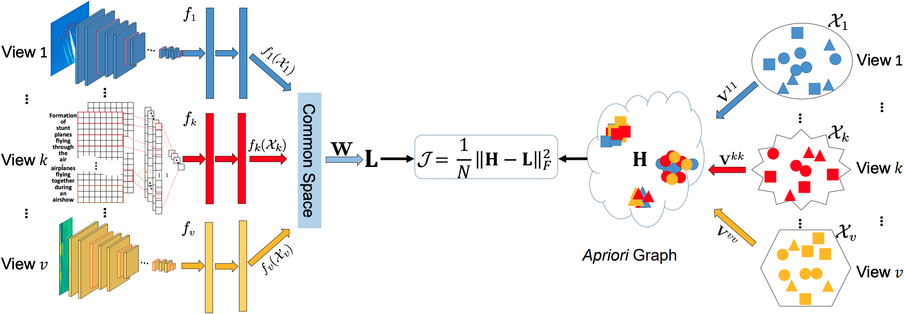
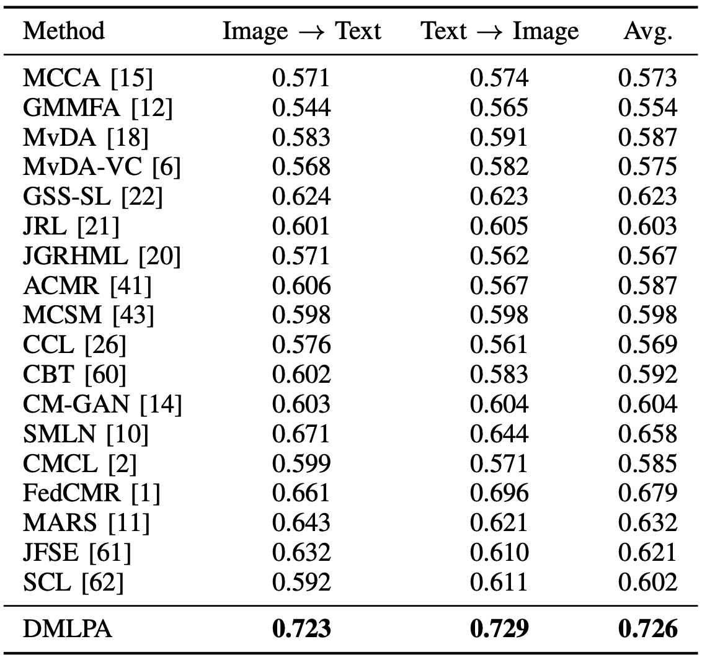
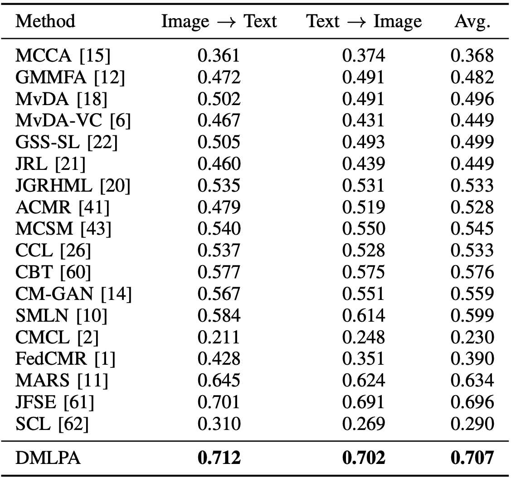
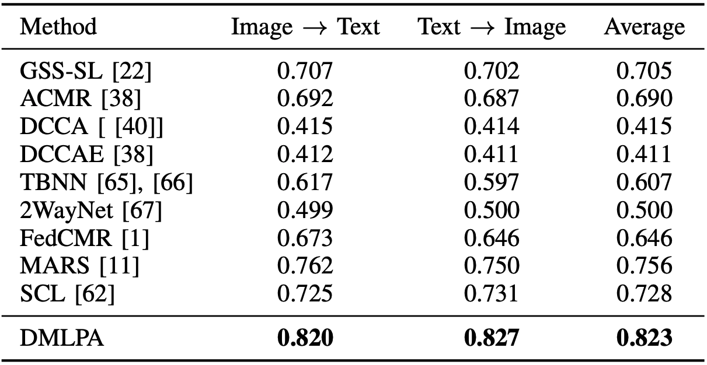

# 2024-TIP-DMLPA
Peng Hu, Liangli Zhen, Xi Peng, Hongyuan Zhu, Jie Lin, Xu Wang, Dezhong Peng, Deep Supervised Multi-View Learning with Graph Priors (IEEE TIP 2024, PyTorch Code).

## Abstract
This paper presents a novel method for supervised multi-view representation learning, which projects multiple views into a latent common space while preserving the discrimination and intrinsic structure of each view. Specifically, an \textit{apriori} discriminant similarity graph is first constructed based on labels and pairwise relationships of multi-view inputs. Then, view-specific networks progressively map inputs to common representations whose affinity approximates the constructed graph. To achieve graph consistency, discrimination, and cross-view invariance, the similarity graph is enforced to meet the following constraints: 1) pairwise relationship should be consistent between the input space and common space for each view; 2) within-class similarity is larger than any between-class similarity for each view; 3) the inter-view samples from the same (or different) classes are mutually similar (or dissimilar). Consequently, the intrinsic structure and discrimination are preserved in the latent common space using an \textit{apriori} approximation schema. Moreover, we present a sampling strategy to approach a sub-graph sampled from the whole similarity structure instead of approximating the graph of the whole dataset explicitly, thus benefiting lower space complexity and the capability of handling large-scale multi-view datasets. Extensive experiments show the promising performance of our method on five datasets by comparing it with 18 state-of-the-art methods.

## Framework


Fig. 1: The framework of DMLPA. In the figure, distinct shapes are used to represent diverse classes and distinct colors are used to denote different views. **W** and **V<sup>kk</sup>** are the similarity matrices of all common representations and the *k*-th view inputs 𝒳<sub>*k*</sub>, respectively. **L** and **H** are the normalized graph Laplacian matrices that represent the graphs of common space and input data, respectively. Moreover, **L** and **H** are respectively computed by **W** and **V**<sup>*kl*</sup>\|<sub>*k*, *l*</sub><sup>*v*</sup>, where **V**<sup>*kl*</sup>\|<sub>*k* ≠ *l*</sub><sup>*v*</sup> are inter-view similarity matrices computed by intra-view similarity matrices **V<sup>kk</sup>**\|<sub>*k*</sub><sup>*v*</sup> and labels. $\mathcal{J} = \frac{1}{N} \| \mathbf{H} - \mathbf{L} \|_{F}^{2}$ is the loss to make the obtained common representations approximate \textit{apriori} similarity graph of input data.


## Usage
To train a model, just run train.sh:
```bash
sh train.sh
```

## Comparison with the State-of-the-Art
<div align=center>TABLE IV: Comparative results (MAP@ALL) for cross-view retrieval on the Pascal Sentence dataset.</div>
<div align=center></div>

<div align=center>TABLE V: Comparative results (MAP@ALL) for cross-view retrieval on the XMediaNet dataset.</div>
<div align=center></div>

<div align=center>TABLE VI: Comparative results (MAP@ALL) for cross-view retrieval on the MS-COCO dataset.</div>
<div align=center></div>


## Citation
If you find DMLPA useful in your research, please consider citing:
```
@inproceedings{hu2024deep,
   title={Deep Supervised Multi-View Learning with Graph Priors},
   author={Peng Hu, Liangli Zhen, Xi Peng, Hongyuan Zhu, Jie Lin, Xu Wang, Dezhong Peng},
   booktitle={IEEE Transactions on Image Processing},
   pages={},
   year={2024}
}
```
